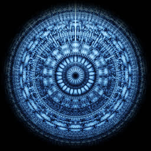
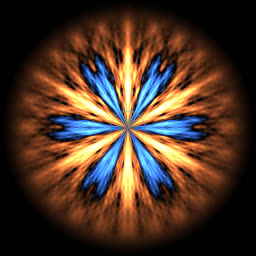
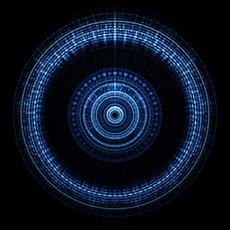
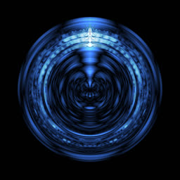
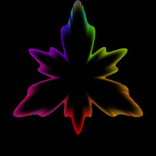
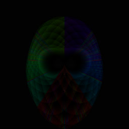

# The AutoCorrelation Function

> _[Autocorrelation](https://pages.mtu.edu/~suits/autocorrelation.html) is used to compare a signal with a time-delayed version of itself. If a signal is periodic, then the signal will be perfectly correlated with a version of itself if the time-delay is an integer number of periods. That fact, along with related experiments, has implicated autocorrelation as a potentially important part of signal processing in human hearing._

 ACF is a simple method to visualize music that produces surprisingly good results. Perhaps the most unexpected property of ACF is that it accurately transfers the subjective "harmony level" from music to images. It's almost an unreasonable property, if you think about it.

 Images below are ACF height maps in polar coordinates. ACF values are linearly mapped from -3sigma .. +3sigma range to the blue..orange palette.

Female vocal         | David Parsons        | Vivaldi                 | a bird
-------------------- | -------------------- | ----------------------- | ---
 |  |  | 

More examples: [soundshader.github.io/gallery](https://soundshader.github.io/gallery/) (beware of large images).

Live demo: [soundshader.github.io](https://soundshader.github.io/)

# Why ACF matches our perception of sound

Contrary to what you might think, our ears don't seem to rely on an FFT-like process to extract isolated frequencies. Instead, our ears detect periodic parts in the signal, although in most cases those periodic parts closely match the FFT frequencies. There is a simple [experiment](https://auditoryneuroscience.com/pitch/missing-fundamental-stimuli) that proves this point:


As can be clearly seen on the FFT image, the A signal is a pure sinusoidal tone, while B is a mix of tones. Despite each tone in B is higher than A, our ears perceive B as a lower tone. If we plot both waveforms, we'll see that A has about 9 peaks in a 20 ms window, while B has only 5. The definition of "peak" is moot, but it doesn't stop our ears from counting them and using the "number of peaks per second" as a proxy to the tone height.

ACF detects those peaks. ACF sees that there are 5 equally spaced time shifts where `B[t] * B[t + shift]` reaches the maximum, so on the ACF output we'll see those 5 peaks.

> Given that I've shamelessly stolen the experiment's illustration above, I feel obligated to recommend the book where the illustration came from: [Auditory Neuroscience](https://auditoryneuroscience.com/book-preview).

One downside of ACF is that it drops the phase component of the input signal, and thus ACF is not reversible. This means that images that only render ACF, lose about 50% of the information from the sound and those 50% are important, e.g. dropping the phase from recorded speech makes that speech indiscernible. Real world sounds, such as voice, heavily use nuanced amplitude and phase modulation. ACF captures the former, but ignores the latter.

# Visualizing ACF

ACF of a sound sample `X[0..N-1]` can be computed with two FFTs:

```
S = |FFT[X]|^2
ACF[X] = FFT[S]
```

And thus ACF contains exactly the same information as the spectral density `S` (the well known spectrogram).

> If you're familiar with the ACF definition, you'll notice that I should've used the inverse FFT in the last step. There is no mistake. The inverse FFT can be computed as `FFT[X*]*`, where `X*` is complex conjugate, but since `S[i]` is real-valued (and positive, in fact), the conjugate has no effect on it, and since ACF is also real valued in this case, the second conjugate has no effect either.

ACF is a periodic and even function and so it can be naturally rendered in polar coordinates. In most cases, ACF has a very elaborate structure. Below are some examples, where red = ACF > 0 and blue = ACF < 0.

conventional music    | a bird song
--------------------- | ---------------------
 | 

Looking at the first example, we can tell that there are 5 prominent peaks in a 20 ms sound sample, which corresponds to 250 Hz. This means that our ears would necesserarily perceive this sound as a 250 Hz tone, regardless of what its spectrogram says. If it was a pure 250 Hz tone, we'd see perfectly round shapes of the `r = cos(250Hz * t)` line, but it's not the case here: we see that the 5 peaks are modulated with small wavelets: there is one big wavelet in the middle (which consists of 3 smaller wavelets) and 4 smaller wavelets. Our ears would hear the big wavelet as the 2nd harmonic of the 250 Hz tone (i.e. it would be a 500 Hz tone with a smaller amplitude) and the 4 small wavelets as the 5th harmonic (1000 Hz) at barely discernible volume. In addition to that, the 500 Hz harmonic is also modulated by the 3 tiny wavelets, which means we'd hear a 1500 Hz tone, almost inaudible. We can say all this without even looking at the spectrogram or hearing the sound.

# Visualizing the FFT phase

ACF drops the phase component. However the phase can be extracted from the first FFT and mixed with the ACF shape. On the examples below, the radial coordinate is the ACF value, while color is the FFT phase. The first image is a 20 ms sample of conventional music, while the next two images are bird songs. The phase appears mostly continuous, with sudden jumps in certain places. The discontinuities might be caused by rounding errors in the FFT algorithm, but I haven't looked into this deeper.

conventional music    | a bird song
--------------------- | ---------------------
 | 

I couldn't find a visually appealing way to incorporate these FFT phase colors into ACF images. But I don't think it's even necessary: sampling ACF with an overlap effectively captures the phase.

# How I came up with this idea

Music is a temporal ornament. There are many types of ornaments, e.g. the 17 types of wallpaper tesselations, but few of them look like music. However there is one particular type of ornament that resembles music a lot - I mean those "mandala" images. I don't know how and why those are produced, but I noticed a connection between those images and music:

- The 1st obvious observation is that a mandala is drawn in polar coordinates and is `2*PI` periodic. Sound is periodic too, so I thought the two facts are related.
- The 2nd observation is that patterns on those images evolve over the radial axis. Ans so is music is a sequence of evolving sound patterns.
- The 3rd observation is that a `2*PI` periodic function trivially corresponds to a set of frequencies. We usually use FFT to extract the frequencies and another FFT to restore the `2*PI` periodic function. Thus, a single radial slice of a mandala could encode a set of frequencies. If this is correct, a mandala is effectively an old school vinyl disk.

Putting these observations together we naturally arrive with the ACF idea.

# Taking it to 3D

In fact, this idea can be extended to 3D-space. ACF correlates a wave with a delayed copy of itself: `ACF[p] = w[0..N] * w[p..N+p]`. Nothing stops us from computing a [tri-correlation](https://en.wikipedia.org/wiki/Triple_correlation):

`ACF3[p, q] = w[0..N] * w[p..N+p] * w[q..N+q]`

The `ACF3` function will be `N` periodic over both its parameters and thus can be naturally mapped to a sphere: `p` will become longitude and `q` - latitude. A series of `ACF3` spheres can be combined together the same way and we'd get a 3D equivalent of the images above. I don't know what the result would look like, but rendering it would need a really good GPU, as just storing the `ACF3` buffer would need about `S(N)` = `N^2*T*fps*sizeof(float)` = `8192^2*15*60*4` = 230 GB of GPU memory (well, 25 GB if we notice symmetries of `ACF3`). On top of that, a raymarching algorithm would need to cast rays thru this spherical cloud, which is about `T(N)` = `O(N^3*fps)` ~ 245 TFlops (don't forget that interpolation of ACF3 values along the ray isn't free). That's on the edge of the $500K [DGX-2](https://www.nvidia.com/content/dam/en-zz/Solutions/Data-Center/dgx-1/dgx-2-datasheet-us-nvidia-955420-r2-web-new.pdf)'s ability.

# Questions?

Open an issue on github or shoot me a email at ssgh@aikh.org

# License

AGPLv3
